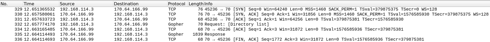

# Gopher Client

## Wireshark initial request/response

## Run the script 
    python gopher_client.py
or

    python3 gopher_client.py

## Files and Directories 
gopher_client.py: main function, run this file to run the client

gopher_crawler.py: file with the GopherCrawler class which is used to store fields that will be printed after crawling

util_functions.py: utility functions that do not need to be encapsulated by the GopherCrawler class 

### Output directories
The client will create an output directory to store all files downloaded from the server. There is a text and bin directory to store text and binary files respectively.

## Clarifications
### Timeout  
A timeout value of 5 seconds is set for all socket operations. This also means that if the server is continuously sending data for longer than 5 seconds, the client will stop receiving data and disregard the previously sent data. While 5 seconds is somewhat arbitrary, this was decided so that the crawling did not take too long. Most servers should respons within 5 seconds. This value can be changed easily in the global variable timeout_value in util_functions

### Error and invalid references 
If any error occurs during the reading of a response from a server such as a timeout, this reference will be added to the list of error references. 
If a request for a directory responds with an error reference (starts with 3), this directory will be counted as an invalid reference. If a resource is listed to be a binary or text file type, it is assumed that a request for these files will respond with the file data and thus it is impossible to receive an invalid reference. 

### External Servers 
For the purpose of this client, an external server is any server with a different host to comp3310.ddns.net or a port different to 70.

### Smallest Text file 
The output from the program will print the smallest non-empty text file. This is because an empty text file has no contents and does not provide very useful information about the server. 

### Counting directories
The client will count all unique directory references not unique directory names. So if a directory has a different name but has the same path as a previously visitited directory it will not be visited or counted again. All directories listed on the server will be counted including invalid directories and empty directories. 